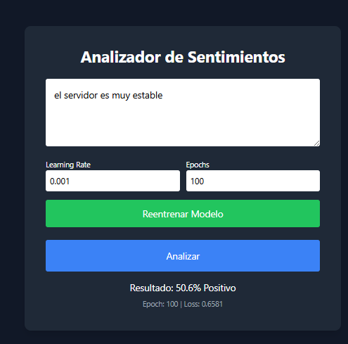
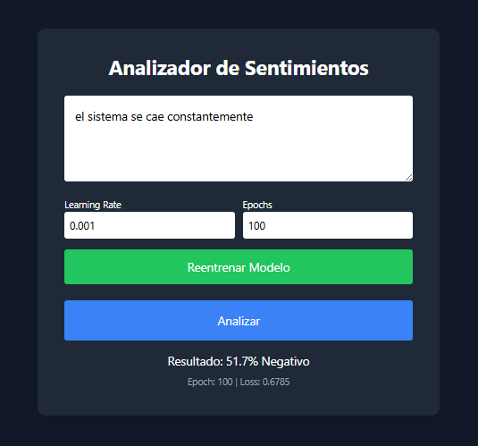

# Analizador de Sentimientos con IA

## Descripción
Este proyecto consiste en el desarrollo de una aplicación web que utiliza una red neuronal para clasificar opiniones de texto como positivas o negativas.

## Tecnologías utilizadas
- HTML5
- Tailwind CSS
- JavaScript
- TensorFlow.js

## Arquitectura del modelo
Se implementó un modelo de red neuronal secuencial compuesto por:
- Capa de entrada (Embedding)
- Capa oculta (Densa)
- Capa de salida (Sigmoid)

## Funcionamiento
El sistema recibe un texto ingresado por el usuario, lo procesa mediante técnicas básicas de NLP (tokenización), lo convierte en valores numéricos y lo evalúa utilizando el modelo entrenado.

El resultado se presenta como un porcentaje de probabilidad indicando si el texto es positivo o negativo.

## Dataset
Se utilizó un conjunto de datos en formato JSON con frases técnicas clasificadas en dos categorías:
- Positivo (1)
- Negativo (0)

## Hiperparámetros
Se implementó la modificación dinámica de los hiperparámetros:
- Learning Rate
- Epochs
Esto permite observar cómo cambia el comportamiento del modelo en tiempo real.

## Entrenamiento del modelo
Se visualiza el proceso de entrenamiento mediante el valor de la función de pérdida (Loss) en cada época, permitiendo analizar la convergencia del modelo.

## Limitaciones
- Dataset limitado
- No comprende contexto complejo (ej. sarcasmo)
- Modelo simple

## Conclusión
El proyecto demuestra cómo una red neuronal puede aprender patrones a partir de datos y realizar predicciones probabilísticas.  
Además, se evidenció cómo los hiperparámetros afectan directamente la precisión y la incertidumbre del modelo.

## Evidencia

### Interfaz

### Prueba con hiperparámetros

### Resultado del modelo

## Estudiante
Shirly Hernandez
